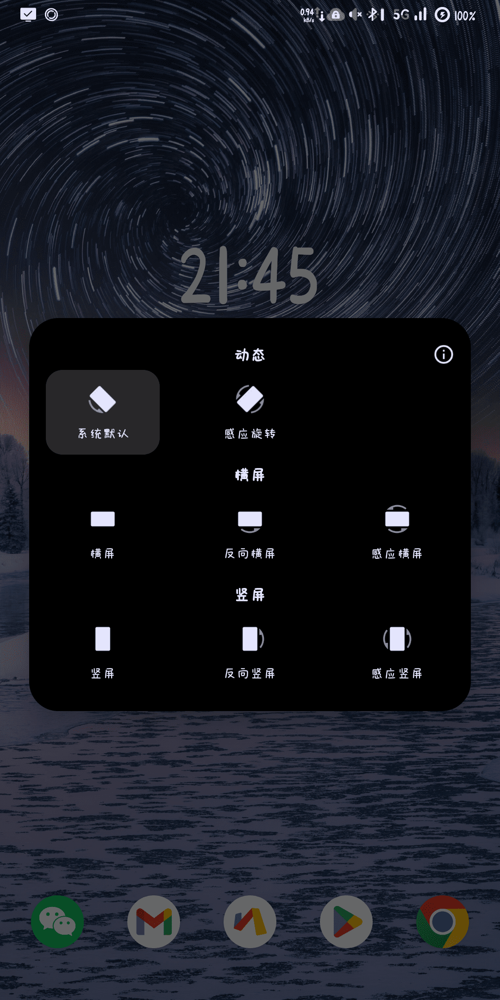

# YiTate ✨ [yitate.92li.uk](https://yitate.92li.uk)

### Made with love ❤️

YiTate 是一个开源 App，帮助你轻松锁定屏幕方向，适用于 Android 5+。

## 截图

## 特性 🌟

- **极简轻量**：体积只有不到 100k，真正的小而美哦！
- **设计简洁**：易于使用且直观的界面，轻松上手～
- **开源**：无依赖，无广告，无追踪器，纯净体验！

## 为什么开发 YiTate？ 

当你躺在被窝里耍手机，或使用一个 Android 系统的平板时，你一定会发现有些应用不支持横屏或特定方向。有时候，这真是一件让人郁闷的事儿。我尝试过市面上的一些锁定屏幕方向的应用，但它们功能太复杂，而我只想要一个简单的工具来锁定屏幕方向。于是，我就决定自己动手写一个啦！

锁定屏幕方向的原理其实很简单，就是用悬浮窗添加一个透明的窗口，在这个窗口里指定屏幕方向。由于悬浮窗位于其它软件上方，于是系统就会按照悬浮窗的要求来旋转屏幕。这个 App 非常简单，我不想让它变得复杂，所以我使用原生方法实现，没有任何第三方组件。尽情享受吧！

## 获取

可在 [Releases](https://github.com/lingyicute/Yitate/releases) 获得发行版本和 Nightly 构建版本。 

> [!IMPORTANT]
> 对于 Nightly 构建版本，请自行对 APK 实施签名。

## LICENSE 📜

Copyright (C) 2024 lingyicute.

This program is free software: you can redistribute it and/or modify
it under the terms of the GNU General Public License as published by
the Free Software Foundation, either version 3 of the License, or
(at your option) any later version.

This program is distributed in the hope that it will be useful,
but WITHOUT ANY WARRANTY; without even the implied warranty of
MERCHANTABILITY or FITNESS FOR A PARTICULAR PURPOSE.  See the
GNU General Public License for more details.

You should have received a copy of the GNU General Public License
along with this program.  If not, see https://www.gnu.org/licenses.
